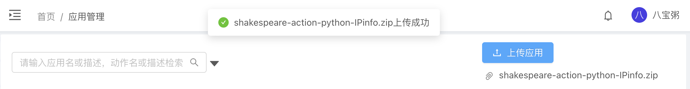

# Octomation编排自动化产品应用能力APP

# 使用方法

下载您需要的应用APP安装包，访问OctoMation应用管理界面https://<OCTOMATION_SERVER>/apps，点击【上传应用】。

部分APP上传后可能需要配置资源参数，如：IP、端口、账号、密码、API KEY等。

# 应用APP列表

## 网络工具

应用名称 | 应用厂商 | 厂商手册| 下载地址 | 贡献人
---|---|---|---|---
IP数据库IPinfo | [IPinfo](https://ipinfo.io) | [API Docs](https://ipinfo.io/developers/data-types#geolocation-data)| [下载](https://github.com/flagify-com/OctoMationApps/releases/download/APP/shakespeare-action-python-IPinfo.zip) | [wzfukui](https://github.com/wzfukui)
微步在线V3     | [微步在线](https://threatbook.com/) | [API Docs](https://x.threatbook.com/v5/apiDocs)| [下载](https://github.com/flagify-com/OctoMationApps/releases/download/APP/shakespeare-action-threatbook_v3-1.2.1.zip) | [wzfukui](https://github.com/wzfukui)
消息通知-钉钉  | [钉钉](https://www.dingtalk.com/) | [API Docs](https://open.dingtalk.com/document/) | [下载](https://github.com/flagify-com/OctoMationApps/releases/download/APP/shakespeare-action-dingtalk-1.0.zip) | [wzfukui](https://github.com/wzfukui)
Kafka客户端   | [Kafka](https://kafka.apachecn.org/) | 无 | [下载](https://github.com/flagify-com/OctoMationApps/releases/download/APP/shakespeare-action-kafka-1.0.zip) | [wzfukui](https://github.com/wzfukui)
HTTP客户端    | [雾帜智能](https://flagify.com/) | 无 | [下载](https://github.com/flagify-com/OctoMationApps/releases/download/APP/shakespeare-action-python-HTTP_Client.zip) | [J0hnFFFF](https://github.com/J0hnFFFF)
SSH客户端     | [雾帜智能](https://flagify.com/)  | 无 | [下载](https://github.com/flagify-com/OctoMationApps/releases/download/APP/shakespeare-action-python-ssh_req.zip) | [J0hnFFFF](https://github.com/J0hnFFFF)
RSS客户端     | [雾帜智能](https://flagify.com/)  | 无 | [下载](https://github.com/flagify-com/OctoMationApps/releases/download/APP/shakespeare-action-python-RSS_Feed_Parser.zip) | [wzfukui](https://github.com/wzfukui)
工具箱        | [雾帜智能](https://flagify.com/)  | 无 | [下载](https://github.com/flagify-com/OctoMationApps/releases/download/APP/shakespeare-action-python-tools.zip) | [J0hnFFFF](https://github.com/J0hnFFFF)
Scamalytics威胁情报        | [Scamalytics](https://scamalytics.com/)  | 无 | [下载](https://github.com/flagify-com/OctoMationApps/releases/download/APP/shakespeare-action-python-Scamalytics.zip) | [J0hnFFFF](https://github.com/J0hnFFFF)
X军刀 | [雾帜智能](https://flagify.com/)  | 无 | [下载](https://github.com/flagify-com/OctoMationApps/releases/download/APP/shakespeare-action-python-xKnife.zip) | [wzfukui](https://github.com/wzfukui)
AppDemo | [雾帜智能](https://flagify.com/)  | 无 | [下载](https://github.com/flagify-com/OctoMationApps/releases/download/APP/shakespeare-action-python-app_demo.zip) | [wzygm](https://github.com/wzygm)
VirusTotal 威胁情报 | [virustotal](https://www.virustotal.com/)  | [API Docs](https://developers.virustotal.com/reference/overview) | [下载](https://github.com/flagify-com/OctoMationApps/releases/download/APP/shakespeare-action-virustotal-1.2.1.zip) | [wzygm](https://github.com/wzygm)
alienVault 开源威胁情报 | [alienVault](https://otx.alienvault.com/)  | [API Docs](https://otx.alienvault.com/api) | [下载](https://github.com/flagify-com/OctoMationApps/releases/download/APP/shakespeare-app-python-alienVault_otx.zip) | [wzygm](https://github.com/wzygm)
GitHub助手 | [GitHub](https://github.com/)  | [API Docs](https://docs.github.com/en/rest/overview) | [下载](https://github.com/flagify-com/OctoMationApps/releases/download/APP/shakespeare-action-python-GitHubAssistant.zip) | [wzfukui](https://github.com/wzfukui)
阿里云WAF | [阿里云](https://cn.aliyun.com/)  | [API Docs](https://help.aliyun.com/document_detail/433759.html?spm=a2c4g.433750.0.i0) | [下载](https://github.com/flagify-com/OctoMationApps/releases/download/APP/shakespeare-action-python-aliyun_waf.zip) | [wzfukui](https://github.com/wzfukui)
EMAIL工具 | [雾帜智能](https://flagify.com/)  | 无 | [下载](https://github.com/flagify-com/OctoMationApps/releases/download/APP/shakespeare-action-python-email_tool.zip) | [wzfukui](https://github.com/wzfukui)
企业微信 | [雾帜智能](https://work.weixin.qq.com/)  | [API Docs](https://work.weixin.qq.com/#indexOpen) | [下载](https://github.com/flagify-com/OctoMationApps/releases/download/APP/shakespeare-action-python-tencent_wecom.zip) | [wzfukui](https://github.com/wzfukui)
