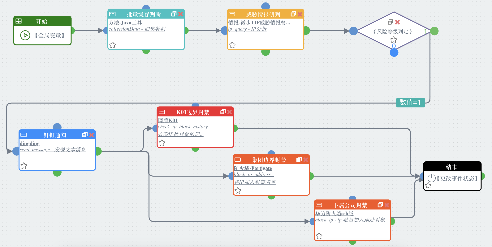
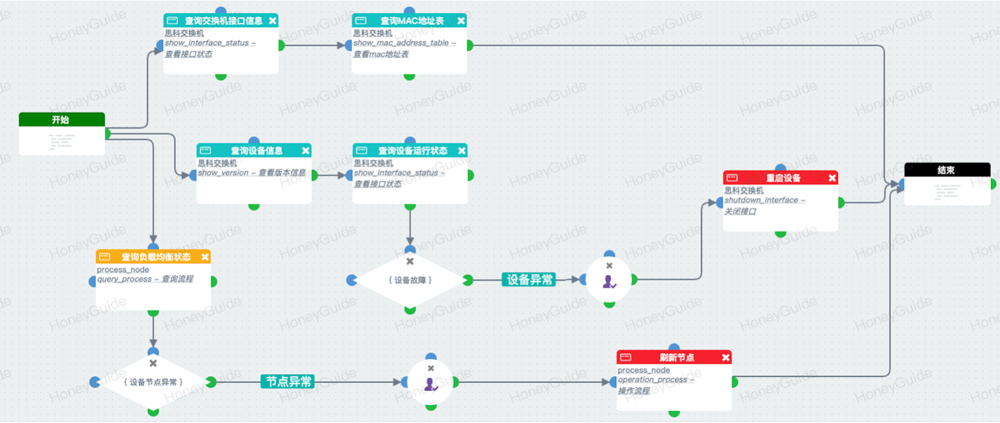
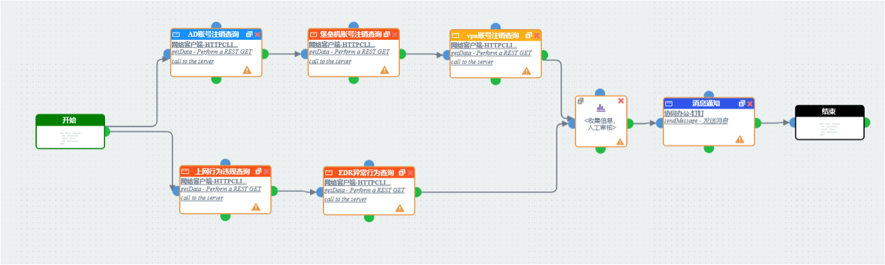
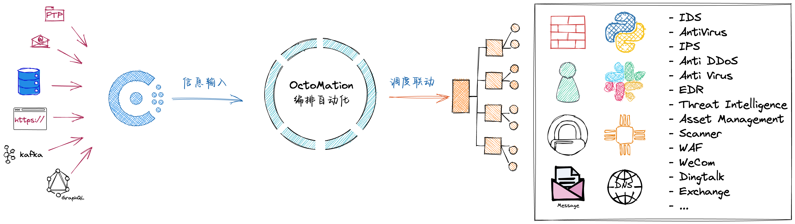
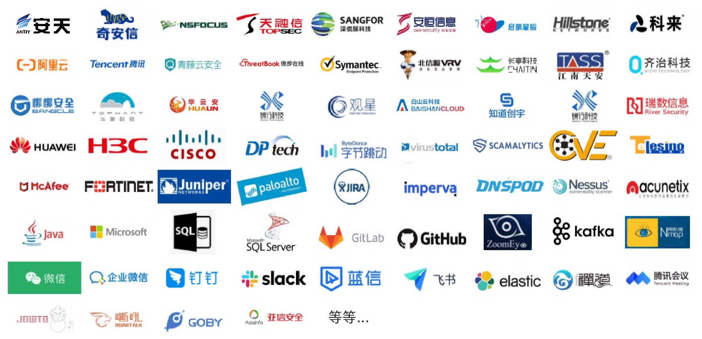

- [OctoMation编排自动化](#octomation编排自动化)
- [产品特性](#产品特性)
- [应用场景](#应用场景)
  - [网络安全：安全事件应急响应](#网络安全安全事件应急响应)
  - [运维：网络故障诊断](#运维网络故障诊断)
  - [IT：员工入离职账号启停与违规审查](#it员工入离职账号启停与违规审查)
- [技术知识](#技术知识)
  - [架构图](#架构图)
  - [应用对接](#应用对接)
- [安装部署](#安装部署)
  - [快速安装](#快速安装)
  - [免费激活](#免费激活)
  - [导入社区剧本和应用（按需）](#导入社区剧本和应用按需)
- [用户交流](#用户交流)
  - [参与GitHub Discussions互动交流（优先方式）](#参与github-discussions互动交流优先方式)
  - [参与微信群聊](#参与微信群聊)
  - [提交GitHub Issues](#提交github-issues)
- [其它](#其它)
  - [隐私声明](#隐私声明)
  - [社区贡献原则](#社区贡献原则)
  - [社区免费版与企业版的区别](#社区免费版与企业版的区别)
  - [备注](#备注)

  

<h1 align="center">OctoMation——消灭重复劳动，提升工作效率</h1>
 

# OctoMation编排自动化

**OctoMation编排自动化**（Octopus Orchestration & Automation）是上海雾帜智能科技有限公司HoneyGuide SOAR产品的社区免费版，是中国企业市场领先的编排和自动化（Orchestration & Automation， O&A）产品。

OctoMation支持用户通过**可视化、低代码甚至无代码**的方式拖拽生成剧本（Playbook），连接网络设备、安全产品、IT系统和SaaS服务等基础能力，实现各类流程的可视化编排和自动化执行，可用于网络安全编排自动化与响应，运维自动化，IT服务自动化甚至是客服、风控等场景，有无限的想象空间。

新手速成QuickBook：
- [🐙我的第一个OctoMation Playbook](https://github.com/flagify-com/OctoMation/wiki/%E6%88%91%E7%9A%84%E7%AC%AC%E4%B8%80%E4%B8%AAOctoMation-Playbook)
- [🐙我的第一个OctoMation 事件接入](https://github.com/flagify-com/OctoMation/wiki/%E6%88%91%E7%9A%84%E7%AC%AC%E4%B8%80%E4%B8%AAOctoMation-%E4%BA%8B%E4%BB%B6%E6%8E%A5%E5%85%A5)
- [🐙我的第一个OctoMation 应用APP开发](https://github.com/flagify-com/OctoMation/wiki/%E6%88%91%E7%9A%84%E7%AC%AC%E4%B8%80%E4%B8%AAOctoMation-%E5%BA%94%E7%94%A8APP%E5%BC%80%E5%8F%91)

阅读完整的帮助文档，请移步[OctoMation Wiki](https://github.com/flagify-com/OctoMation/wiki)。

# 产品特性

- **响应速度快**
> 基于O&A（ Orchestration & Automation）技术的OctoMation编排自动化系统，可帮助用户实现“分钟级甚至秒级的事件响应，几十倍上百倍的效率提升”。

- **编排可视化**
> 支持可视化操作的剧本画布，为用户带来极佳的编排操作体验，内置：动作、规则、审批、轮询、虚拟、收集等可编排的节点，支持按需设置节点颜色，也支持循环、剧本嵌套、函数等高级能力。

- **连接数量多**
> 继承HoneyGuide SOAR企业市场应用对接能力，支持450+（还在持续增加）主流产品能力对接，目前正在逐步开放中。

- **开放能力强**
> 提供开放的SDK、标准的应用模板和可视化的应用开发工具，允许用户自主实现应用能力对接，增强产品连接能力。

# 应用场景

<h2 align="center">当生产力不再是问题，剩下的就是想象力！</h2>

 
OctoMation剧本编排应用场景（展开查看详情）

## 网络安全：安全事件应急响应

> 态势感知/SOC/SIEM发现攻击者IP，需要第一时间进行IP封禁。封禁和解封本身也有特定的逻辑，需要注意。

OctoMation实战效果：
- 1个人1分钟内完成全局处置（原本可能多人，多设备，数十分钟完成）
- 规则明确情况下，可实现7x24小时自动化处置
- 全自动完成多项协作任务：识别封禁对象、判断黑白名单、判断CDN、判断业务IP、决策封禁设备、下发封禁指令、延迟自动解封、维护封禁列表
- 快速、高效、精准、免人工干预

## 运维：网络故障诊断

> 企业办公网或生产网发生网络故障，需要快速定位问题，排除故障，恢复网络。

OctoMation实战效果：
- 一键获取多设备、系统的第一现场数据
- 基于专家剧本快速开展排障调查
- 智能决策网络优化或恢复策略
- 人工审批后通过仿真环境或真实环境批量下发策略
- 完成快速诊断和网络恢复

## IT：员工入离职账号启停与违规审查

> 人员离职、转岗涉及到大量审计和配置工作，如：近期内部DLP系统告警、近期员工账号异常活跃告警、内部各类系统的权限撤销、公司身份认证系统账号的禁用等等。

OctoMation实战效果：
- 5分钟完成原本需要50分钟完成的审查工作
- 绝大多数场景无需人工干预，只有在审计发现风险时才会人工干预
- 入离职高峰期大幅降低审计人员的工作压力（这类工作因为敏感性，通常不适合委托）

# 技术知识
## 架构图

- OctoMation支持通过Kafka、Syslog等方式接收上游的信息输入，根据与编排的剧本，开展自动化的流程执行。
- OctoMation支持通过HTTP/HTTPS、SSH、Telnet、Restful API等方式联动调度下游基础产品能力。

## 应用对接

根据雾帜智能HoneyGuide SOAR的基础积累，允许在编排界面调用80个类别，150个厂商的450+产品的1200个动作能力。OctoMation作为编排自动化产品的社区免费版，可以直接活动改能力。目前相关应用APP正在整理中，将陆续投放到社区。

针对尚未完成对接暂不支持调度的外部产品能力，OctoMation提供应用开发工具和开放SDK，允许社区用户根据需要自行开发对接。我们也希望社区成员能够在完成能力对接后，将相关成果贡献到社区，共同丰富和维护产品的外部连接能力。

> 更多场景，等你来发挥！

# 安装部署

## 快速安装

关于系统要求，软件依赖和具体安装说明，**请参考WIKI文档**：[OctoMation安装部署手册](https://github.com/flagify-com/OctoMation/wiki/OctoMation%E5%AE%89%E8%A3%85%E9%83%A8%E7%BD%B2%E6%89%8B%E5%86%8C)。

## 免费激活

OctoMation是HoneyGuide SOAR的社区免费版，为了规范产品使用，促进社区健康发展，让我们的后续支持更加有针对性，社区免费版需要导入一个免费的授权License。

您可以直接访问[OctoMation社区免费版License申请地址](https://flagify.com/e1598bd6f9a583)，也可以手机端扫码申请。

成功获取免费激活的授权文件后，登录系统导入授权文件。

## 导入社区剧本和应用（按需）

OctoMation安装成功后，用户可以自己创建应用和剧本，也可以导入社区免费版提供的各类应用和剧本，详细请参考：

- ⏬[应用能力APP包](./App%20Packages/AppPackages.md)
- ⏬[场景剧本Playbook包](./Playbook%20Packages/PlaybookPackages.md)

# 用户交流

## 参与GitHub Discussions互动交流（优先方式）

您可以在[GitHub Discussions](https://github.com/orgs/flagify-com/discussions)与我们互动，提交您的💡💡💡想法、玩法和需求，与社区成员进行思想碰撞。我们也将不定期在Discussions上做活动，帮助更多用户快速用上和用好OctoMation编排自动化产品。

## 参与微信群聊

微信扫码（10天更新一次），参与社区微信群聊互动。

<!--  -->

如果扫码失败，请加小助手微信，备注：OctoMation，拉你进群。

## 提交GitHub Issues

欢迎通过[GitHub Issues](https://github.com/flagify-com/OctoMation/issues)界面向我们提交Bug、问题🙋🙋🙋。

# 其它
## 隐私声明

我们尊重所有用户的隐私安全需求，遵守社区规范，详情请参考：[OctoMation产品隐私声明](PRIVACY.md)

## 社区贡献原则

鼓励社区成员参与剧本、应用的开发和共享，当前（Oct. 2023）整体原则如下：

- **剧本Playbook**
  - 社区内产生或贡献的剧本，社区共享
  - 雾帜官方对外公开的剧本，社区共享
- **应用App**
  - HoneyGuide SOAR作为商业版，会逐步开放已经对接的各种能力到社区，短期内以应用包方式提供，不提供源代码，未来会逐步开放。（涉及到企业客户知识产权、内部信息，代码结构和版本等问题）
  - OctoMation社区内完成或贡献的应用，直接开放应用源代码，社区共享
- **其他**
  - 函数、插件、思路等，社区共享
  - 欢迎参与编写社区文档，让更多人能够更好地用上OctoMation编排自动化🐙🐙🐙

## 社区免费版与企业版的区别

除了用户总数和同时在线用户数有限制，社区免费版其它所有功能都不受限制。

其它差别我们正在整理，稍后放出。

## 备注
- [上海雾帜智能科技有限公司](https://flagify.com)正式成立于2019年4月，创始团队来华为、唯品会、千寻位置和小米等对安全运营有极高要求的企业。
- 智能风险决策系统HoneyGuide SOAR是雾帜智能于2019年8月正式发布的一款基于AI+SOAR的产品，旨在帮助客户“加速安全响应 ，智能安全运营”，是大量客户在智能安全运营领域的首选品牌（嘶吼安全产业研究院《安全编排自动化与响应(SOAR)市场研究报告》，2023.06）。
- 编排和自动化技术不仅可以用于安全，还可以在网络运维、IT服务、客服、风控甚至工业制造领域发挥做用，可谓“来自安全，但又不止于安全”。
